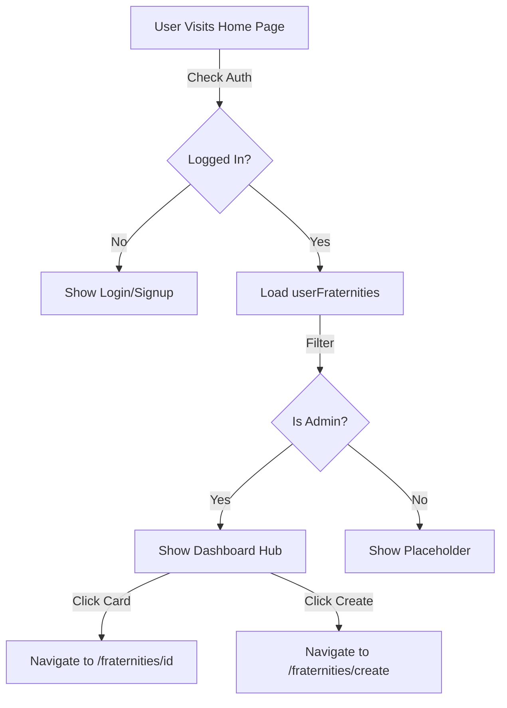

# Dashboard Hub for Fraternity Admins

## Overview

Transform `app/page.js` (home page) to show a fraternity dashboard hub for users who are admins of at least one fraternity. Non-admin users will see the current home page behavior (login/signup buttons) as a placeholder until the events feed page is implemented in Phase 1.4.

## Decision Logic

```javascript
User State
├── Not Logged In → Show Login/Signup buttons (current behavior)
├── Logged In + Admin of at least 1 fraternity → Show Dashboard Hub
└── Logged In + Not Admin → Show current home page (placeholder)
```


## Current State Analysis

### Existing Components

- **`app/page.js`**: Current home page with login/signup buttons
- **`contexts/FraternityContext.js`**: Provides `userFraternities` array with role information
- **`components/FraternityCard.js`**: Reusable card component with variants ('default', 'compact', 'detailed')
- **`app/fraternities/[id]/page.js`**: Individual fraternity dashboard (navigation target)
- **`app/fraternities/create/page.js`**: Fraternity creation page

### Data Structure from FraternityContext

```javascript
userFraternities = [
  {
    fraternity: {
      id, name, type, photo_url,
      verified, member_verified,
      member_count, quality_member_count
    },
    role: 'admin' | 'member' | 'pledge'
  },
  // ...
]
```


### What Needs to Be Built

1. Admin filtering logic in `app/page.js`
2. Dashboard hub UI section for admin users
3. Conditional rendering based on admin status
4. Navigation handlers for fraternity cards and create button
5. Handle loading and error states

## Implementation Steps

### Step 1: Add Admin Filtering Logic

**File**: `app/page.js`**Add after existing state declarations**:

```javascript
// Filter to admin fraternities only
const adminFraternities = userFraternities
  .filter(f => f.role === 'admin')
  .map(f => f.fraternity) // Extract fraternity object for FraternityCard

const isAdmin = adminFraternities.length > 0
```

**Location**: After line 25 (after `const { userFraternities, loading: fraternityLoading } = useFraternity()`)

### Step 2: Add Dashboard Hub UI Section

**File**: `app/page.js`**Add imports** (if not already present):

```javascript
import FraternityCard from '@/components/FraternityCard'
```

**Replace the center area section** (lines 95-98) with conditional rendering:**New structure**:

```javascript
{/* Center area - Dashboard Hub for admins, placeholder for others */}
<div className="flex-1 overflow-y-auto px-6 py-8">
  {user && isAdmin ? (
    // Dashboard Hub Section
    <div className="space-y-6">
      {/* Header */}
      <div>
        <h1 className="text-heading1 text-neutral-black mb-4">
          My Fraternities
        </h1>
        <Button
          onClick={() => router.push('/fraternities/create')}
          variant="primary"
          size="large"
          className="w-full"
        >
          Create New Fraternity
        </Button>
      </div>

      {/* Fraternity Cards List */}
      {adminFraternities.length > 0 ? (
        <div className="space-y-4">
          {adminFraternities.map((fraternity) => (
            <FraternityCard
              key={fraternity.id}
              fraternity={fraternity}
              onClick={() => router.push(`/fraternities/${fraternity.id}`)}
              showMemberCount={true}
              variant="default"
            />
          ))}
        </div>
      ) : (
        // Empty State (edge case)
        <Card>
          <p className="text-center text-bodySmall text-gray-medium py-8">
            No fraternities found. Create your first fraternity to get started.
          </p>
        </Card>
      )}
    </div>
  ) : (
    // Placeholder for non-admin users (current empty center area)
    <div className="flex items-center justify-center">
      {/* Empty for now - future: redirect to events feed */}
    </div>
  )}
</div>
```


### Step 3: Update Conditional Rendering for Login/Signup Buttons

**File**: `app/page.js`**Update bottom buttons section** (lines 100-122):**Change**:

```javascript
{/* Bottom buttons - only show when not logged in */}
{!user && (
  <div className="w-full px-6 pb-10 safe-area-bottom">
    <div className="flex gap-4">
      <Button
        onClick={openLoginModal}
        variant="secondary"
        size="large"
        className="flex-1"
      >
        Log In
      </Button>
      <Button
        onClick={openSignupModal}
        variant="primary"
        size="large"
        className="flex-1"
      >
        Sign Up
      </Button>
    </div>
  </div>
)}
```

**Location**: Replace existing bottom buttons section (lines 100-122)

### Step 4: Update FraternityPrompt Logic

**File**: `app/page.js`**Update showPrompt logic** (line 56-59):**Change from**:

```javascript
const showPrompt = user && 
                   !promptDismissed && 
                   !fraternityLoading && 
                   userFraternities.length === 0
```

**Change to**:

```javascript
const showPrompt = user && 
                   !promptDismissed && 
                   !fraternityLoading && 
                   !isAdmin && // Don't show prompt if user is admin
                   userFraternities.length === 0
```

**Location**: After admin filtering logic (after Step 1)

### Step 5: Handle Loading States

**File**: `app/page.js`**Update loading condition** (line 62):**Current**:

```javascript
if (authLoading) {
```

**Update to**:

```javascript
if (authLoading || fraternityLoading) {
```

**Location**: Line 62**Note**: This ensures dashboard doesn't render until fraternity data is loaded

## Architecture Flow




## Error Handling

### Loading States

1. **Auth Loading**: Show spinner while checking authentication

- Already handled in existing code
- Update to also wait for `fraternityLoading`

2. **Fraternity Loading**: Wait for fraternity data before showing dashboard

- Add `fraternityLoading` to loading condition
- Prevents showing incorrect state

### Edge Cases

1. **User is admin but userFraternities is empty**:

- Shouldn't happen, but handle gracefully
- Show empty state message: "No fraternities found. Create your first fraternity to get started."

2. **User has mixed roles** (admin of some, member of others):

- Only show admin fraternities in the hub
- Filter correctly based on `role === 'admin'`

3. **Error from FraternityContext**:

- Context handles errors internally
- Dashboard will show empty state if `userFraternities` is empty

4. **Navigation errors**:

- Use Next.js router (already imported)
- Errors will be handled by Next.js routing

## Success Criteria

1. ✅ Admin users see dashboard hub with their admin fraternities
2. ✅ Non-admin users see current home page behavior
3. ✅ Logged-out users see login/signup buttons
4. ✅ Fraternity cards are clickable and navigate correctly
5. ✅ Create button navigates to fraternity creation page
6. ✅ Loading states work correctly (waits for fraternity data)
7. ✅ Empty state shows when user has no admin fraternities (edge case)
8. ✅ FraternityPrompt doesn't show for admin users
9. ✅ Login/signup buttons only show for logged-out users
10. ✅ Multiple admin fraternities display correctly

## Files to Modify

### Primary File

1. **`app/page.js`**:

- Add `FraternityCard` import
- Add admin filtering logic
- Add dashboard hub UI section
- Update conditional rendering for login/signup buttons
- Update FraternityPrompt logic
- Update loading condition

### Files to Reference (No Changes)

- `contexts/FraternityContext.js` - Provides `userFraternities` data
- `components/FraternityCard.js` - Reusable card component
- `app/fraternities/[id]/page.js` - Individual fraternity dashboard (navigation target)
- `app/fraternities/create/page.js` - Fraternity creation page (navigation target)
- `components/ui/Button.js` - UI component
- `components/ui/Card.js` - UI component

## Code Patterns to Follow

### Admin Filtering Pattern

```javascript
// Filter to admin fraternities only
const adminFraternities = userFraternities
  .filter(f => f.role === 'admin')
  .map(f => f.fraternity) // Extract fraternity object for FraternityCard

const isAdmin = adminFraternities.length > 0
```


### Conditional Rendering Pattern

```javascript
{user && isAdmin ? (
  // Dashboard Hub
  <DashboardHubContent />
) : (
  // Placeholder or login/signup
  <PlaceholderContent />
)}
```


### Navigation Pattern

```javascript
// Card click navigation
onClick={() => router.push(`/fraternities/${fraternity.id}`)}

// Create button navigation
onClick={() => router.push('/fraternities/create')}
```


## Testing Checklist

### Admin User Scenarios

- [ ] User is admin of 1 fraternity → Dashboard hub shows 1 card
- [ ] User is admin of multiple fraternities → Dashboard hub shows all cards
- [ ] Click fraternity card → Navigates to `/fraternities/[id]`
- [ ] Click "Create New Fraternity" → Navigates to `/fraternities/create`
- [ ] Dashboard shows correct fraternity info (name, photo, member count, verification)

### Non-Admin User Scenarios

- [ ] User is member but not admin → Shows current home page (placeholder)
- [ ] User has no fraternities → Shows current home page + FraternityPrompt banner
- [ ] Login/signup buttons still visible when logged out

### Loading & Error States

- [ ] Loading spinner shows while fetching fraternities
- [ ] Dashboard doesn't render until `fraternityLoading === false`
- [ ] Empty state shows if admin user has no fraternities (edge case)

### UI/UX

- [ ] Fraternity cards are properly styled and clickable
- [ ] Member counts display correctly
- [ ] Verification status displays correctly
- [ ] Create button is prominent and accessible
- [ ] Layout is responsive and works on mobile

## Future Considerations

### Phase 1.4 Integration

- Once events feed page (`app/events/page.js`) is implemented:
- Update non-admin user flow to redirect to `/events` page
- Replace placeholder with: `router.push('/events')`

### Potential Enhancements

1. **Quick Actions on Cards**:

- Add "Manage Members" button on each card
- Add "Create Event" button (if verified)
- Quick stats display

2. **Navigation Menu**:

- Add header/navigation bar for easier access
- Link to events feed, profile, etc.

3. **Aggregate Stats**:

- Show total fraternities managed
- Show total members across all fraternities
- Show overall verification status

4. **Filtering/Sorting**:

- Sort fraternities by verification status
- Filter by type (fraternity/sorority/other)
- Search functionality

## Notes

- This implementation uses existing components and patterns
- No new database queries needed (data comes from FraternityContext)
- No new server actions needed
- Minimal changes to existing code structure